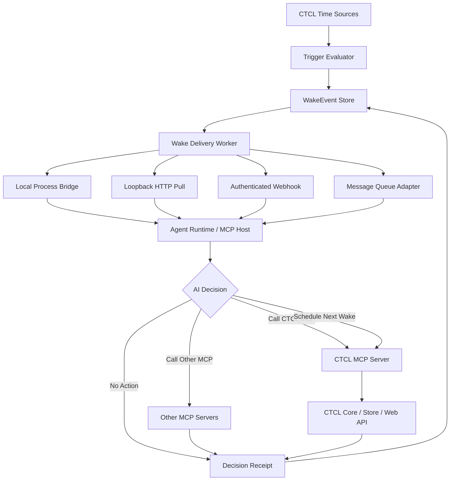

# CTCL Agent Wake & MCP Temporal Runtime 技術白皮書

**副標題：** 以共同瞬間、主觀時間與 WakeEvent 建立 AI 的間歇喚醒及自主工具調用基礎層  
**版本：** v0.1  
**日期：** 2026-07-19  
**作者：** Neo.K／一言諾科技有限公司（EVEMISSLAB）  
**適用專案：** CTCL Web、CTCL Temporal Port、未來 Agent Runtime 整合  
**文件類型：** 技術白皮書／實作規格草案  
**狀態：** Proposed

---

## 摘要

CTCL（Common Temporal Coordinate Layer）目前已提供共同參考瞬間、異質時間轉換、自訂時間系統、Temporal Groups、Boundary Inspector、Constraint Planner、Agent 工具宣告，以及本地 Temporal Port 的 Device Clock Observer、Local Gateway 與 Trigger Engine。現有 Trigger Engine 已能定期檢查絕對時間或自訂時間條件，並在條件成立後執行通知或 URI callback。

然而，目前系統仍主要實現：

$$
\text{Temporal Condition}
\rightarrow
\text{Fixed Action}
$$

尚未完整實現：

$$
\text{Temporal Condition}
\rightarrow
\text{Wake Agent}
\rightarrow
\text{AI Decision}
\rightarrow
\text{MCP Tool Invocation}
$$

本白皮書提出 CTCL Agent Wake & MCP Temporal Runtime 擴充。CTCL 不直接內建特定大型語言模型，也不變成通用 Agent 平台；CTCL 僅負責建立可靠的時間條件、WakeEvent、交付與確認機制。外部 Agent Runtime／MCP Host 負責載入記憶、執行模型決策、管理權限、選擇 MCP 工具及回傳決策結果。

此設計保留 CTCL 作為時間基礎設施的單一職責，同時使其成為持續性 AI、模擬器、機器人、數位分身與多 Agent 系統的時間喚醒入口。

---

## 1. 現況與問題

### 1.1 CTCL Web 現況

CTCL Web 已具備：

- `GET /v1/now`；
- `POST /v1/convert`；
- 共同瞬間註冊與取回；
- 自訂時間系統；
- Temporal Groups；
- Boundary Inspector；
- Semantic Resolution；
- Constraint Planner；
- `/openapi.json`；
- `/ai/ctcl.json`；
- JavaScript SDK；
- 公開狀態與信任資訊。

因此，在模型已經執行的情況下，Agent 可以透過 HTTP 或未來 MCP Adapter 主動調用 CTCL。

### 1.2 CTCL Temporal Port 現況

本地 App 已具備：

- Rust 核心；
- SQLite 持久化；
- Tauri 桌面應用；
- Local Gateway；
- Bearer Token；
- Capability Scope；
- Audit Log；
- Device Clock Observer；
- Trigger Engine；
- 背景執行緒；
- 自訂時間與群組 UI。

Trigger Engine 目前支援：

$$
I^* \geq I_{\text{target}}
\Rightarrow
\text{action}
$$

以及：

$$
\tau_{\text{custom}} \geq \tau_{\text{target}}
\Rightarrow
\text{action}
$$

亦支援 $\leq$，不支援容易被輪詢跨越的精確相等條件。

### 1.3 主要缺口

目前 action 主要為：

- `notification`；
- `callback`。

缺少：

- WakeEvent 持久化佇列；
- Agent Wake Bridge；
- Agent Runtime 回執；
- 由 Agent 建立下一次喚醒的 Local API；
- 標準 MCP Server；
- 任務完成後重新喚醒的整合；
- 重複交付防護；
- 脈衝式排程；
- 失敗與死信管理。

---

## 2. 設計目標

### 2.1 主要目標

1. 讓 CTCL 可以在時間條件成立時產生可持久化 WakeEvent。
2. 讓外部 Agent Runtime 可可靠接收或拉取 WakeEvent。
3. 讓 Agent 在醒來後自行判斷是否調用 MCP 工具。
4. 讓 Agent 可建立、修改或取消下一次喚醒。
5. 保留 Local Gateway 的 Token、Scope 與 Audit 模型。
6. 避免 CTCL 綁定單一模型供應商。
7. 避免 CTCL 直接承擔完整 Agent 記憶與規劃。
8. 支援本地、遠端與混合部署。
9. 支援一次性、週期性與主觀時間觸發。
10. 保證觸發、交付、決策與行動狀態彼此可區分。

### 2.2 非目標

本階段不包含：

- 內建通用 LLM；
- 自動取得所有使用者資料；
- 任意 shell 執行；
- 無限制遠端 webhook；
- 替代完整工作流引擎；
- 替代 MCP Host；
- 宣稱 CTCL 本身具有自主性；
- 保證作業系統關閉 App 後仍可執行；
- 手機背景常駐保證。

---

## 3. 核心邊界

### 3.1 CTCL 負責

- 共同瞬間；
- 自訂時間；
- 時間條件；
- Trigger；
- WakeEvent；
- 事件交付；
- 冪等、重試與審計；
- Agent 可用的時間 MCP 工具。

### 3.2 Agent Runtime 負責

- 啟動模型；
- 載入記憶；
- 讀取目標；
- 決定是否行動；
- MCP Host 與 Client 管理；
- 權限與成本治理；
- 工具結果理解；
- 建立下一次喚醒；
- 向 CTCL 回傳決策狀態。

### 3.3 MCP Server 負責

- 暴露 CTCL 工具；
- 驗證參數；
- 呼叫 CTCL Core、Store 或 Web API；
- 回傳結構化結果。

核心分工：

$$
\text{CTCL}
=
\text{Temporal Authority Interface}
+
\text{Wake Infrastructure}
$$

$$
\text{Agent Runtime}
=
\text{Decision}
+
\text{Orchestration}
$$

$$
\text{MCP}
=
\text{Capability Interface}
$$

---

## 4. 目標架構



---

## 5. Trigger 與 WakeEvent 分離

### 5.1 Trigger

Trigger 是持久條件定義：

```json
{
  "id": "trigger:agent-hourly-review",
  "kind": "common_instant",
  "operator": ">=",
  "target_value": 1784422800,
  "recurrence": {
    "type": "interval",
    "seconds": 3600
  },
  "action": {
    "kind": "agent_wake",
    "target": "agent:primary"
  },
  "status": "active"
}
```

### 5.2 WakeEvent

WakeEvent 是條件成立後產生的一次不可變事件：

```json
{
  "event_id": "wake:01J...",
  "trigger_id": "trigger:agent-hourly-review",
  "agent_id": "agent:primary",
  "reason": "temporal_condition_satisfied",
  "fired_at": {
    "instant_id": "ctcl:instant:...",
    "unix_s": "1784422800.123",
    "source": "local_temporal_port"
  },
  "observed": {
    "system_id": null,
    "operator": ">=",
    "target_value": 1784422800,
    "observed_value": 1784422800.123
  },
  "payload": {
    "goal_refs": ["goal:ctcl-development"],
    "decision_policy": "model_decides"
  },
  "delivery": {
    "status": "pending",
    "attempt_count": 0,
    "next_attempt_at": null
  },
  "created_at": "2026-07-19T13:00:00+08:00"
}
```

### 5.3 為何必須分離

現有流程容易把「action dispatch 成功」等同於「任務完成」。未來必須區分：

$$
\text{TriggerDue}
\neq
\text{WakeCreated}
\neq
\text{WakeDelivered}
\neq
\text{AgentAcknowledged}
\neq
\text{AgentActed}
$$

建議狀態：

```text
pending
→ delivering
→ delivered
→ acknowledged
→ decided_no_action
→ decided_action
→ completed
```

失敗分支：

```text
delivering
→ retry_wait
→ dead_letter
```

---

## 6. 資料庫擴充

建議新增 SQLite 資料表。

### 6.1 `wake_events`

```sql
CREATE TABLE wake_events (
    event_id TEXT PRIMARY KEY,
    trigger_id TEXT,
    agent_id TEXT NOT NULL,
    reason TEXT NOT NULL,
    fired_instant_json TEXT NOT NULL,
    observed_json TEXT NOT NULL,
    payload_json TEXT NOT NULL,
    status TEXT NOT NULL,
    attempt_count INTEGER NOT NULL DEFAULT 0,
    next_attempt_at TEXT,
    delivered_at TEXT,
    acknowledged_at TEXT,
    completed_at TEXT,
    idempotency_key TEXT NOT NULL UNIQUE,
    created_at TEXT NOT NULL,
    last_error TEXT
);
```

### 6.2 `agent_endpoints`

```sql
CREATE TABLE agent_endpoints (
    agent_id TEXT PRIMARY KEY,
    transport TEXT NOT NULL,
    endpoint TEXT NOT NULL,
    auth_ref TEXT,
    enabled INTEGER NOT NULL DEFAULT 0,
    allowed_event_kinds_json TEXT NOT NULL,
    created_at TEXT NOT NULL,
    updated_at TEXT NOT NULL
);
```

### 6.3 `decision_receipts`

```sql
CREATE TABLE decision_receipts (
    receipt_id TEXT PRIMARY KEY,
    event_id TEXT NOT NULL,
    agent_id TEXT NOT NULL,
    run_id TEXT NOT NULL,
    decision TEXT NOT NULL,
    summary TEXT,
    tool_calls_json TEXT,
    next_wake_json TEXT,
    cost_json TEXT,
    created_at TEXT NOT NULL,
    FOREIGN KEY(event_id) REFERENCES wake_events(event_id)
);
```

### 6.4 `dead_letters`

可直接使用 `wake_events.status='dead_letter'`，或建立獨立表保存最終錯誤與人工處理記錄。

---

## 7. ActionKind 擴充

現有：

```rust
pub enum ActionKind {
    Notification,
    Callback,
}
```

建議第一階段改為：

```rust
pub enum ActionKind {
    Notification,
    Callback,
    AgentWake,
}
```

不建議第一階段直接加入 `McpCall`。

原因是：

$$
\text{Time Trigger}
\rightarrow
\text{Direct MCP Call}
$$

會讓 CTCL 開始承擔：

- MCP Client 生命週期；
- Server 發現；
- 工具選擇；
- 跨工具編排；
- 模型決策；
- 權限與語義判斷。

CTCL 應先只產生 `AgentWake`，再由 Agent Runtime 決定是否調用 MCP。

---

## 8. Wake Delivery Worker

### 8.1 背景執行緒

新增：

```text
wake_delivery.rs
```

職責：

1. 查詢 `pending` 或 `retry_wait` 事件；
2. 根據 `agent_endpoints.transport` 選擇交付器；
3. 執行交付；
4. 成功後標記 `delivered`；
5. 失敗後使用指數退避；
6. 超過次數後進入 `dead_letter`。

### 8.2 指數退避

$$
d_n
=
\min
\left(
d_{\max},
d_0 2^n + \epsilon
\right)
$$

其中 $\epsilon$ 為隨機抖動，避免多事件同時重試。

### 8.3 交付器 trait

```rust
pub trait WakeDispatcher: Send + Sync {
    fn deliver(
        &self,
        endpoint: &AgentEndpoint,
        event: &WakeEvent,
    ) -> Result<WakeDeliveryReceipt, WakeDeliveryError>;
}
```

### 8.4 第一階段支援的 transport

建議優先順序：

1. `local_process`；
2. `loopback_http`；
3. `poll_only`；
4. `remote_webhook`；
5. `queue_adapter`。

---

## 9. Agent Wake Bridge

### 9.1 本地程序模式

CTCL 啟動已登記的 Agent Runtime：

```text
agent-runtime.exe --wake-event <event_id>
```

安全要求：

- 不允許任意命令字串；
- 可執行檔必須由使用者明確登記；
- 路徑需正規化；
- 參數使用結構化模板；
- 預設停用；
- 每次啟動寫入審計；
- 支援最大併發數。

### 9.2 Loopback HTTP 模式

CTCL 對：

```text
http://127.0.0.1:<port>/v1/wake
```

送出 WakeEvent。

要求：

- 綁定 localhost；
- 雙方 Bearer Token；
- 可選 HMAC 簽章；
- `event_id` 作為冪等鍵；
- Agent Runtime 回傳 `202 Accepted`；
- 不將 `202` 視為任務完成。

### 9.3 Poll-only 模式

Agent Runtime 定期呼叫 CTCL：

```text
GET /v1/wake-events?status=pending&agent_id=agent:primary
```

取得事件後：

```text
POST /v1/wake-events/{event_id}/ack
```

這是最容易實現且最可靠的 MVP，但它需要 Agent Runtime 自己具備輪詢能力。

### 9.4 遠端 webhook

遠端 webhook 應延後，因其涉及：

- 公網暴露；
- OAuth 或簽章；
- 重放攻擊；
- SSRF；
- DNS 變更；
- TLS 驗證；
- 秘密管理。

---

## 10. Local API 擴充

### 10.1 Trigger API

新增：

```http
POST /v1/triggers
GET /v1/triggers
GET /v1/triggers/{id}
POST /v1/triggers/{id}/cancel
POST /v1/triggers/{id}/rearm
```

### 10.2 WakeEvent API

新增：

```http
GET /v1/wake-events
GET /v1/wake-events/{event_id}
POST /v1/wake-events/{event_id}/ack
POST /v1/wake-events/{event_id}/complete
POST /v1/wake-events/{event_id}/retry
```

### 10.3 Agent Endpoint API

新增：

```http
GET /v1/agents
POST /v1/agents
GET /v1/agents/{agent_id}
POST /v1/agents/{agent_id}/enable
POST /v1/agents/{agent_id}/disable
```

### 10.4 Decision Receipt API

新增：

```http
POST /v1/wake-events/{event_id}/decision
GET /v1/wake-events/{event_id}/decision
```

範例：

```json
{
  "run_id": "run:01J...",
  "decision": "no_action",
  "summary": "No repository changes since last review.",
  "tool_calls": [],
  "next_wake": {
    "kind": "relative",
    "after_seconds": 3600
  },
  "cost": {
    "model_tokens": 1832,
    "tool_calls": 2
  }
}
```

---

## 11. Capability Scope 擴充

建議新增：

```text
triggers.read
triggers.write
triggers.cancel
wake_events.read
wake_events.ack
wake_events.complete
agents.read
agents.write
agent_wake.dispatch
decision_receipts.write
```

預設策略：

| Scope | 預設 |
|---|---:|
| `triggers.read` | 開啟 |
| `wake_events.read` | 開啟 |
| `wake_events.ack` | 關閉 |
| `triggers.write` | 關閉 |
| `agents.write` | 關閉 |
| `agent_wake.dispatch` | 關閉 |
| `decision_receipts.write` | 關閉 |

所有具有副作用的能力預設關閉。

---

## 12. CTCL MCP Server

### 12.1 部署形式

建議建立兩個 Adapter。

#### Local MCP

```text
ctcl-mcp
```

傳輸：

- 優先 `stdio`；
- 可選 localhost Streamable HTTP。

#### Remote MCP

```text
https://commoninstant.org/mcp
```

傳輸：

- Streamable HTTP；
- 驗證 Origin；
- 適當認證；
- 速率限制；
- 只暴露適合遠端的能力。

### 12.2 工具命名

建議使用：

```text
ctcl.now
ctcl.convert
ctcl.register_instant
ctcl.get_instant
ctcl.list_systems
ctcl.system_now
ctcl.create_system
ctcl.expand_group
ctcl.inspect_boundary
ctcl.resolve_temporal_context
ctcl.plan_shared_instant
ctcl.create_trigger
ctcl.list_triggers
ctcl.cancel_trigger
ctcl.list_wake_events
ctcl.ack_wake_event
ctcl.complete_wake_event
ctcl.schedule_pulse
```

### 12.3 讀寫分離

遠端 MCP 可優先提供讀取與計算型工具；本地 MCP 才提供：

- 寫入本地 Store；
- 建立 Trigger；
- Agent Endpoint；
- WakeEvent ack；
- 決策回執。

### 12.4 工具註解

每個工具應標示：

- 是否唯讀；
- 是否具副作用；
- 是否冪等；
- 是否需要確認；
- 是否可作為長任務；
- 所需 Scope；
- 預期成本。

---

## 13. `schedule_pulse` 抽象

Agent 不應被迫直接計算所有絕對時間欄位。可提供高階工具：

```json
{
  "agent_id": "agent:primary",
  "pulse": {
    "kind": "relative_interval",
    "after_seconds": 3600
  },
  "reason": "review_goal",
  "payload": {
    "goal_refs": ["goal:ctcl-development"]
  },
  "policy": {
    "max_occurrences": 24,
    "stop_after_no_progress": 5
  }
}
```

支援類型：

- `absolute_instant`；
- `relative_delay`；
- `fixed_interval`；
- `custom_system_time`；
- `boundary_event`；
- `adaptive_review`。

`adaptive_review` 可先保留為未實作宣告，避免虛構功能。

---

## 14. 週期性 Trigger

目前一次性 Trigger 觸發後進入 `fired`。未來可增加：

```rust
pub enum Recurrence {
    Once,
    Interval { seconds: u64 },
    CustomStep { system_id: String, delta: f64 },
}
```

當 WakeEvent 成功建立後，週期 Trigger 不立即結束，而是計算下一目標：

$$
I_{\text{next}}
=
I_{\text{current target}}
+
\Delta I
$$

為避免 App 長時間停止後產生大量補發事件，需設定 catch-up 策略：

```text
skip_missed
fire_once
fire_all_bounded
```

預設應為：

```text
fire_once
```

即恢復後只產生一次代表性 WakeEvent。

---

## 15. 主觀時間喚醒

CTCL 的獨特價值不只在牆鐘排程，而在自訂時間系統。

例如 Agent 活動時間：

$$
\tau_A(I)
=
\int_{I_0}^{I}
\chi_{\text{active}}(u)\,du
$$

當：

$$
\tau_A \geq 8\text{ hours}
$$

可喚醒 Agent 進行：

- 記憶整理；
- 目標回顧；
- 模型切換評估；
- 自我測試；
- 工作負載調整。

對模擬器：

$$
\tau_{\text{world}}(I)
=
r(I-I_0)+b
$$

可在虛擬世界第 $100$ 年喚醒敘事、經濟或治理 Agent，而不必把世界時間硬轉成固定牆鐘。

---

## 16. Device Clock Observer 整合

現有 Observer 可識別：

- `normal`；
- `drift`；
- `sleep_wake`；
- `rollback`。

未來可選擇將異常轉成 WakeEvent：

```json
{
  "reason": "device_clock_anomaly",
  "payload": {
    "classification": "rollback",
    "observed_gap_seconds": -122.4
  }
}
```

預設不應直接喚醒所有 Agent，而應由 Agent Endpoint 設定訂閱類型。

---

## 17. MCP Tasks 與 CTCL WakeEvent

MCP Tasks 適合：

- 長時間批次轉換；
- 大量時間戳驗證；
- 大型群組展開；
- 外部同步；
- 歷史資料遷移。

整合模式：

```text
Agent Run
→ MCP tool call with task
→ receive task_id
→ save task_id
→ schedule CTCL wake
→ sleep
→ CTCL wakes Agent
→ Agent calls tasks/get
→ completed then tasks/result
```

因此 CTCL 可提供：

```text
ctcl.schedule_task_poll
```

輸入：

- `task_id`；
- `server_ref`；
- `poll_after`；
- `max_attempts`；
- `agent_id`。

CTCL 不需要理解任務內容，只負責下一次可靠喚醒。

---

## 18. 安全模型

### 18.1 預設關閉

以下功能必須預設關閉：

- Local API；
- Trigger Engine；
- Wake Delivery；
- Agent Endpoint；
- 遠端 webhook；
- 寫入型 MCP 工具。

### 18.2 本地 MCP 安全

依 MCP Streamable HTTP 安全建議：

- 僅綁定 `127.0.0.1`；
- 驗證 `Origin`；
- 使用認證；
- 不綁定 `0.0.0.0`；
- 限制請求大小；
- 速率限制；
- 記錄工具調用。

### 18.3 命令執行限制

`local_process` 不接受任意 command。Agent Runtime 必須先註冊：

```json
{
  "agent_id": "agent:primary",
  "executable": "C:\\Program Files\\EveMiss\\agent-runtime.exe",
  "argument_template": ["--wake-event", "{event_id}"],
  "sha256_allowlist": ["..."]
}
```

### 18.4 Replay 防護

每次交付包含：

- `event_id`；
- `issued_at`；
- `expires_at`；
- nonce；
- HMAC 或簽章。

Agent Runtime 必須拒絕已處理的 `event_id`。

### 18.5 SSRF 防護

遠端 webhook：

- 禁止 loopback、link-local 與私有網段，除非明確本地模式；
- 禁止任意重新導向；
- 驗證 DNS 解析結果；
- 限制協議為 HTTPS；
- 使用 endpoint allowlist。

### 18.6 個資最小化

WakeEvent 只應保存必要引用，不直接複製完整對話、郵件或檔案內容。建議使用 `memory_refs` 與 `goal_refs`。

---

## 19. 審計模型

每次流程至少留下：

```text
trigger_evaluated
wake_event_created
delivery_attempted
delivery_succeeded / failed
agent_acknowledged
decision_received
tool_call_reported
wake_completed
next_trigger_created
```

所有事件應有：

- 時間；
- actor；
- resource；
- action；
- result；
- correlation_id；
- run_id；
- event_id。

---

## 20. UI 擴充

### 20.1 Settings

新增開關：

- Enable Wake Events；
- Enable Wake Delivery；
- Maximum Concurrent Agent Runs；
- Default Retry Policy；
- Dead Letter Retention；
- Allow Local Process Launch；
- Allow Loopback HTTP Delivery。

### 20.2 Agent 頁籤

顯示：

- Agent ID；
- Transport；
- Endpoint；
- Enabled；
- Last Delivery；
- Last Decision；
- Pending Events；
- Failed Events。

### 20.3 WakeEvent 頁籤

顯示：

- pending；
- delivered；
- acknowledged；
- completed；
- dead letter。

支援：

- 手動重試；
- 取消；
- 查看 payload；
- 查看決策回執；
- 建立測試事件。

---

## 21. 錯誤碼

建議新增：

```text
WAKE_EVENT_NOT_FOUND
WAKE_EVENT_ALREADY_ACKNOWLEDGED
WAKE_EVENT_EXPIRED
AGENT_ENDPOINT_NOT_FOUND
AGENT_ENDPOINT_DISABLED
WAKE_DELIVERY_FAILED
WAKE_DELIVERY_REPLAYED
AGENT_CONCURRENCY_LIMIT
TRIGGER_RECURRENCE_INVALID
MCP_TRANSPORT_UNAVAILABLE
DECISION_RECEIPT_INVALID
SCOPE_NOT_GRANTED
LOCAL_PROCESS_NOT_ALLOWLISTED
```

---

## 22. 測試計畫

### 22.1 單元測試

- Trigger 產生唯一 WakeEvent；
- 同一 idempotency key 不重複插入；
- 失敗交付增加 attempt count；
- 超過最大次數進入 dead letter；
- ack 不可重複；
- completed 不可回到 pending；
- 週期 Trigger 正確計算下一目標；
- App 停止後恢復不重複補發；
- `skip_missed`、`fire_once` 行為正確。

### 22.2 整合測試

- 真實 loopback HTTP Agent；
- Bearer Token 錯誤；
- HMAC 錯誤；
- Agent 回傳 `202`；
- Agent 重複接收同一事件；
- Agent 不在線後重試；
- 重新啟動 App 後繼續交付；
- Local MCP `tools/list`；
- Local MCP 建立 Trigger；
- Scope 拒絕寫入；
- Audit Log 完整。

### 22.3 故障注入

- SQLite 鎖定；
- Agent Runtime 崩潰；
- 網路中斷；
- 系統休眠；
- 系統時間回撥；
- 大量 WakeEvent；
- 磁碟空間不足；
- Token 被撤銷。

### 22.4 驗收條件

MVP 驗收：

1. 建立一次性 AgentWake Trigger。
2. 時間到後產生 WakeEvent。
3. Local Agent Runtime 收到事件。
4. Agent 回傳 ack。
5. Agent 可回傳 `no_action`。
6. Agent 可透過 CTCL MCP 建立下一次 Trigger。
7. 全流程可由 event_id 與 run_id 追溯。
8. 重啟 CTCL App 後狀態不遺失。
9. 同一事件不造成重複副作用。
10. 所有寫入型能力預設關閉。

---

## 23. 分階段路線

### Phase 4.5A：WakeEvent Core

- `wake_events` 資料表；
- `ActionKind::AgentWake`；
- Trigger 到 WakeEvent；
- WakeEvent 列表；
- 手動 ack；
- Audit。

### Phase 4.5B：Poll-only Bridge

- Local API 讀取 WakeEvent；
- ack；
- complete；
- decision receipt；
- Trigger write API；
- Agent 可自行安排下一次喚醒。

### Phase 4.5C：Local MCP

- `stdio` MCP Server；
- 基本 CTCL 工具；
- Trigger 與 WakeEvent 工具；
- Scope 映射；
- MCP 調用審計。

### Phase 4.5D：Active Delivery

- Loopback HTTP；
- Local Process；
- 重試與 dead letter；
- Agent Endpoint UI；
- 併發限制。

### Phase 5A：Remote MCP Gateway

- `https://commoninstant.org/mcp`；
- Streamable HTTP；
- 遠端認證；
- 速率限制；
- 讀寫能力分級。

### Phase 5B：Task-aware Temporal Runtime

- MCP Tasks task_id；
- 任務輪詢排程；
- 任務完成 WakeEvent；
- 取消與超時。

### Phase 6：Team Sync 與多 Agent

- Agent 群組；
- 共同瞬間廣播；
- 共享 WakeEvent；
- 多 Agent acknowledgement；
- leader／quorum 策略；
- 遠端同步後端。

---

## 24. 建議程式碼結構

```text
ctcl-app/
├─ ctcl-core/
├─ ctcl-store/
│  ├─ src/
│  │  ├─ trigger.rs
│  │  ├─ wake_event.rs
│  │  ├─ agent_endpoint.rs
│  │  └─ decision_receipt.rs
├─ ctcl-mcp/
│  ├─ src/
│  │  ├─ main.rs
│  │  ├─ tools.rs
│  │  ├─ transport_stdio.rs
│  │  └─ auth.rs
├─ ctcl-desktop/
│  ├─ src/
│  │  ├─ trigger_engine.rs
│  │  ├─ wake_delivery.rs
│  │  ├─ wake_dispatchers/
│  │  │  ├─ poll_only.rs
│  │  │  ├─ loopback_http.rs
│  │  │  └─ local_process.rs
│  │  └─ local_api.rs
```

遠端 CTCL：

```text
ctcl/
├─ src/
│  ├─ worker.js
│  ├─ mcp/
│  │  ├─ protocol.js
│  │  ├─ tools.js
│  │  ├─ auth.js
│  │  └─ session.js
```

若維持單檔 Worker，可先由 build script 生成並合併，但不建議長期讓 MCP 實作繼續膨脹在同一個 `worker.js`。

---

## 25. 最小 Agent Runtime 範例

```python
def handle_wake(event):
    state = load_agent_state(event["agent_id"])
    tools = connect_mcp_servers(
        allowed_capabilities=event["policy"]["allowed_capabilities"]
    )

    decision = model_decide(
        event=event,
        state=state,
        tools=tools.list_tools(),
    )

    if decision.kind == "no_action":
        post_decision_receipt(
            event_id=event["event_id"],
            decision="no_action",
            summary=decision.summary,
        )
        schedule_next_wake_if_needed(decision)
        return

    for call in decision.tool_calls:
        enforce_policy(call)
        result = tools.call(call.name, call.arguments)
        state = update_state(state, result)

    save_agent_state(state)
    post_decision_receipt(
        event_id=event["event_id"],
        decision="action",
        summary=decision.summary,
        tool_calls=decision.tool_calls,
    )
    schedule_next_wake_if_needed(decision)
```

此範例中的 `model_decide`、記憶與其他 MCP Server 都不屬於 CTCL。

---

## 26. 形式化模型

令 Trigger 集合為 $\mathcal{T}$，第 $k$ 次評估時刻為 $I_k$。對任一 Trigger $T_i$，條件函數為：

$$
C_i(I_k,S_k)\in\{0,1\}
$$

若：

$$
C_i(I_k,S_k)=1
$$

則建立 WakeEvent：

$$
E_j
=
\operatorname{Emit}
\left(
T_i,
I_k,
S_k
\right)
$$

交付函數：

$$
L(E_j,A)
\rightarrow
\left\{
\text{delivered},
\text{retry},
\text{dead-letter}
\right\}
$$

Agent 決策：

$$
D_j
=
\pi_\theta
\left(
E_j,
M_j,
G_j,
P_j,
\mathcal{X}_j
\right)
$$

其中：

$$
D_j
\in
\left\{
\text{no-action},
\text{tool-call},
\text{task-create},
\text{human-review},
\text{schedule-next}
\right\}
$$

CTCL 只需持久化足以驗證的回執：

$$
R_j
=
\operatorname{Receipt}
\left(
E_j,
D_j,
X_j,
I_{j+1}
\right)
$$

不必保存模型的完整私有推理過程。

---

## 27. 開放問題

1. Remote MCP 是否與現有 REST API 共用認證，或建立獨立 Token？
2. Agent Endpoint 是否屬於本地使用者設定，或可同步到團隊後端？
3. Decision Receipt 要保存多久？
4. `local_process` 是否應要求可執行檔雜湊固定？
5. 週期 Trigger 的 catch-up 預設是否為 `fire_once`？
6. 多 Agent 同時 ack 同一 WakeEvent 時採 first-wins、broadcast 或 quorum？
7. Web CTCL 是否只提供時間 MCP，將 WakeEvent 保留在 Temporal Port？
8. 是否建立獨立 `ctcl-agent-bridge` 儲存庫，避免桌面 App 膨脹？
9. MCP Tasks 實驗規格變更時，如何維持版本相容？
10. CTCL 應否提供只產生事件、不負責交付的超精簡模式？

---

## 28. 建議決策

本白皮書建議：

1. **先做 WakeEvent Core，不先做遠端 webhook。**
2. **先做 Poll-only，再做主動交付。**
3. **先做 Local MCP，再做 Remote MCP。**
4. **CTCL 不內建 LLM。**
5. **CTCL 不直接決定其他 MCP 工具。**
6. **Agent 可透過 MCP 建立下一次 Trigger。**
7. **所有寫入與喚醒能力預設關閉。**
8. **將 Trigger、WakeEvent、Ack、Decision、Action 分開記錄。**
9. **將 `no_action` 視為正常決策。**
10. **以事件、回執、冪等與審計構成可靠閉環。**

---

## 29. 結論

CTCL 現有的共同瞬間、自訂時間、Trigger Engine、Local Gateway 與權限模型，已具備發展為 Agent 時間喚醒基礎層的主要前置條件。

下一步不需要推翻現有架構，也不應把 CTCL 改造成大型 Agent 平台。最小且正確的擴充是：

```text
Trigger Engine
+ WakeEvent Store
+ Wake Delivery
+ Agent Wake Bridge
+ Local MCP
+ Decision Receipt
```

完成後，CTCL 可提供下列閉環：

$$
\text{時間成立}
\rightarrow
\text{建立 WakeEvent}
\rightarrow
\text{喚醒 Agent}
\rightarrow
\text{AI 自主判斷}
\rightarrow
\text{必要時調用 MCP}
\rightarrow
\text{保存結果}
\rightarrow
\text{安排下一次喚醒}
$$

這使 CTCL 不再只是「取得現在時間」的 API，而成為持續性 AI 的共同時間、主觀生命史與間歇行動入口。

---

## 參考資料

1. CTCL — Common Temporal Coordinate Layer, `https://commoninstant.org/`.
2. CTCL repository, `https://github.com/kakon77777-commits/ctcl`.
3. CTCL Temporal Port repository, `https://github.com/kakon77777-commits/ctcl-app`.
4. Model Context Protocol, Architecture.
5. Model Context Protocol, Tools.
6. Model Context Protocol, Transports.
7. Model Context Protocol, Tasks, experimental specification.

