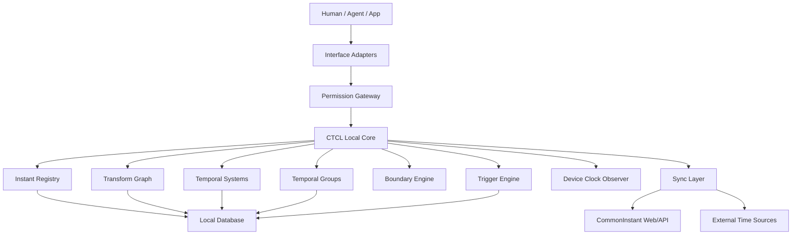

# CTCL Temporal Port App
## 面向共同瞬間與異質時間系統的通用應用端口、本地節點與控制平面技術白皮書

**版本：v0.1**  
**日期：2026-07-11**  
**工作名稱：CTCL Temporal Port / Common Instant App**  
**理論基礎：CTCL — Common Temporal Coordinate Layer**  
**文件定位：App 技術白皮書／本地端點產品架構／應用與 Agent 協議閘道戰略文件**  
**提出者：Neo.K / EVEMISSLAB**

---

# 摘要

CTCL（Common Temporal Coordinate Layer，共同時間座標層）的核心目標，不是讓所有系統使用同一個時鐘，而是讓不同 Agent、應用程式、模擬器、裝置與自定義時間世界能共同指向同一個參考瞬間，並透過可追溯、可版本化的轉換算子得到各自的局部時間表示。

CTCL 最小公式為：

$$
\tau_i=\Phi_i(I^\*)
$$

其中：

- $I^\*$：共同參考瞬間；
- $\tau_i$：第 $i$ 個系統的局部時間；
- $\Phi_i$：時間映射或轉換規則。

CommonInstant.org 可作為 CTCL 的公開協議入口，但網站天然偏向：

- 無安裝；
- 無持久狀態或有限持久狀態；
- 前景互動；
- 公開試用；
- 文件與分享。

CTCL 若要真正進入：

- 裝置；
- 作業系統；
- Agent Runtime；
- 應用程式；
- 本地自動化；
- 長期記憶；
- 模擬與遊戲；
- 背景任務；

則需要一個可安裝、可持久存在、可被其他程式調用的通用端點。

因此，本白皮書提出：

# **CTCL Temporal Port App**

其定位不是一般時鐘 App，而是：

$$
\boxed{
\text{Temporal Protocol Client}
+
\text{Local Temporal Node}
+
\text{Application Gateway}
+
\text{Control Plane}
}
$$

它可以保存自定義時間系統、Temporal Groups、Agent 生命史時間、轉換規則、共同瞬間與觸發條件；可以觀測裝置時鐘、系統休眠、網路恢復與時間漂移；可以透過 Local API、Deep Link、App Intent、URI Scheme、MCP Adapter、SDK Bridge 或 IPC 被其他應用程式與 Agent 調用。

本產品的核心不是「讓人類打開 App 看時間」，而是：

> **讓 CTCL 協議在裝置上擁有一個持久、可呼叫、可離線、可觀測、可控制的通用應用端口。**

---

# 1. 產品命題

## 1.1 為什麼 CTCL 適合做 App

CTCL 天然連接：

$$
\text{Human}
+
\text{Device}
+
\text{Agent}
+
\text{Application}
+
\text{Network}
+
\text{Simulation}
$$

這些對象都可能需要：

- 同一參考瞬間；
- 不同局部表示；
- 本地狀態；
- 長期轉換規則；
- 背景事件；
- 裝置觀測；
- 本地安全邊界；
- 系統級調用。

因此，CTCL 的 App 並非消費者化妥協，而是協議工程上的自然延伸。

---

## 1.2 App 不是普通時間工具

普通時間 App：

$$
\text{UTC}
\rightarrow
\text{Local Time}
\rightarrow
\text{Display}
$$

CTCL App：

$$
\text{Instant}
\rightarrow
\text{Temporal Context}
\rightarrow
\text{Transform Graph}
\rightarrow
\text{Local Service}
\rightarrow
\text{App / Agent / Human Output}
$$

因此：

$$
\boxed{
\text{CTCL App}
\neq
\text{Clock App}
}
$$

---

## 1.3 一句話定位

> **CTCL Temporal Port 是安裝在裝置上的共同瞬間處理器、異質時間協議閘道與本地時間系統工作區。**

---

# 2. 核心產品角色

CTCL App 應同時具備四種身份。

## 2.1 Reference Client

官方參考客戶端，展示：

- CTCL Schema；
- 正確轉換流程；
- 來源呈現；
- 不確定度；
- 邊界警告；
- 版本治理；
- 錯誤處理。

---

## 2.2 Temporal Workspace

保存：

```text
My Instants
My Temporal Systems
My Temporal Groups
My Agents
My Simulations
My Policies
My Triggers
My Transform Versions
```

工作區可表示為：

$$
W_T
=
(
I,
S,
G,
A,
P,
R,
V
)
$$

其中：

- $I$：瞬間；
- $S$：時間系統；
- $G$：群組；
- $A$：Agent／應用身份；
- $P$：政策；
- $R$：規則與觸發器；
- $V$：版本。

---

## 2.3 Local Gateway

其他應用程式不必直接整合完整 CTCL Core。

流程：

$$
\text{Application}
\rightarrow
\text{CTCL Local Gateway}
\rightarrow
\text{CTCL Core / Network}
$$

Local Gateway 可負責：

- 認證；
- 快取；
- 離線；
- 轉換；
- 版本；
- 隱私；
- 限流；
- 稽核；
- 回呼。

---

## 2.4 Temporal Control Plane

管理：

- Instant Registry；
- Temporal Systems；
- Transform Graph；
- Temporal Groups；
- Device Clock；
- Agent Time；
- Triggers；
- Permissions；
- Source Policies；
- Boundary Alerts。

---

# 3. 系統定位

## 3.1 通用時間端口

定義：

$$
\boxed{
\text{CTCL App}
=
\text{Universal Temporal Access Port}
}
$$

上游來源：

```text
Human
Agent
Application
Browser
Simulation
Game
Robot
Research System
Automation
```

統一流程：

```text
Input
↓
Semantic Resolution
↓
Temporal Context
↓
Instant Alignment
↓
Transformation
↓
Validation
↓
Output Adapter
```

輸出：

$$
O=
\begin{cases}
Human\ UI\\
JSON\\
Tool\ Result\\
Event\ Trigger\\
Signed\ Instant\\
Local\ Callback
\end{cases}
$$

---

## 3.2 不成為唯一權威

CTCL App 是：

$$
\text{One Reference Node}
$$

而不是：

$$
\text{Only Authority}
$$

因此：

- 協議可公開；
- 第三方可實作；
- App 可離線；
- 資料可匯出；
- 使用者可選擇來源；
- 不要求所有 CTCL 行為通過官方伺服器。

---

# 4. 為什麼 App 比網站多一層能力

## 4.1 本地持久化

保存：

- 自定義 Epoch；
- 自定義速率；
- 暫停／恢復狀態；
- 群組；
- Agent ID；
- Transform Version；
- Instant History；
- Local Policies；
- Credentials。

---

## 4.2 裝置時鐘觀測

App 可觀測：

- system wall clock；
- monotonic clock；
- timezone；
- locale；
- sleep／wake；
- network reconnect；
- manual clock change；
- clock drift；
- battery saver effects；
- background suspension。

定義偏移：

$$
\Delta t
=
t_{\text{device}}
-
t_{\text{reference}}
$$

若：

$$
|\Delta t|>\tau_{\text{drift}}
$$

建立警告。

---

## 4.3 背景觸發

CTCL App 可註冊：

$$
I^\*=I_{\text{target}}
\Rightarrow
\text{Trigger Action}
$$

或：

$$
\tau_{\text{custom}}=\tau_{\text{target}}
\Rightarrow
\text{Trigger Action}
$$

應用：

- 維護窗口；
- Agent handoff；
- 模擬事件；
- 自定義世界日曆；
- 專案期限；
- 記憶回顧；
- 資料刷新；
- 邊界警告。

---

## 4.4 本地離線轉換

若轉換規則與版本已同步，App 可在離線狀態下完成：

- IANA 時區轉換；
- Unix／ISO 轉換；
- 自定義線性時間；
- 部分 Calendar；
- Temporal Group 展開。

結果需標示：

```text
offline
source_version
last_sync_at
staleness
```

---

# 5. 使用者與調用者

## 5.1 人類開發者

使用：

- Dashboard；
- Converter；
- Boundary Inspector；
- Developer Console；
- Logs；
- Source Selection。

## 5.2 Agent

使用：

- MCP；
- Local Tool API；
- JSON；
- permission-scoped capabilities。

## 5.3 其他 App

使用：

- Deep Link；
- URI Scheme；
- App Intent；
- Localhost API；
- OS share extension；
- IPC。

## 5.4 模擬器與遊戲

使用：

- custom clock；
- pause；
- rate change；
- parent-child mapping；
- event trigger。

## 5.5 研究與長期記憶系統

使用：

- event time；
- write time；
- recall time；
- observed time；
- version time；
- task time。

---

# 6. App 核心功能

## 6.1 Current Common Instant

顯示：

```text
instant_id
reference timescale
reference value
source
uncertainty
sync status
device offset
transform registry version
```

---

## 6.2 Convert

支援：

- Unix；
- RFC 3339；
- ISO 8601；
- UTC；
- POSIX；
- IANA；
- Custom Epoch；
- Custom System；
- Instant ID。

---

## 6.3 My Temporal Systems

自定義系統：

$$
\tau=aI+b
$$

進階：

$$
\tau(t)
=
\int_{t_0}^{t}r(s)\,ds+\phi
$$

其中 $r(s)$ 可：

- 固定；
- 分段；
- 暫停；
- 加速；
- 減速；
- 事件觸發。

---

## 6.4 Temporal Groups

群組：

```text
Project Alpha
├─ Asia/Taipei
├─ America/New_York
├─ Agent A Active Time
├─ Simulation ×20
└─ Maintenance Clock
```

一次展開：

$$
\mathcal E(I^\*,G)
=
\{
\tau_1,\dots,\tau_n
\}
$$

---

## 6.5 Boundary Inspector

檢查：

- DST gap；
- DST fold；
- ambiguous；
- nonexistent；
- clock rollback；
- transform version change；
- rate change；
- pause；
- custom policy boundary。

---

## 6.6 Share Instant

輸出：

- URL；
- QR Code；
- JSON；
- signed payload；
- `ctcl:` URI；
- OS Share Sheet。

---

## 6.7 Trigger & Automation

建立：

```yaml
trigger:
  temporal_system: "agent:active-time"
  condition:
    operator: ">="
    value: 3600
  action:
    type: "callback"
    target: "myapp://task/review"
```

---

## 6.8 Developer Port

提供：

- Local API；
- WebSocket；
- Event Stream；
- MCP Adapter；
- Deep Link；
- App Intent；
- SDK Bridge；
- Webhook Relay。

---

# 7. 本地協議介面

## 7.1 URI Scheme

暫定：

```text
ctcl://instant/<id>
ctcl://convert?from=unix&to=utc&value=...
ctcl://group/<id>/expand?instant=...
ctcl://boundary/inspect?system=...
```

理想化地：

```text
ctcl:
```

可成為時間協議處理器，但第一階段只作私有 Scheme。

---

## 7.2 Localhost API

例如：

```http
GET  http://127.0.0.1:<port>/v1/now
POST http://127.0.0.1:<port>/v1/convert
POST http://127.0.0.1:<port>/v1/trigger
```

必須：

- 默認關閉；
- token auth；
- origin restrictions；
- permission scopes；
- loopback only；
- audit logs。

---

## 7.3 App Intents

可暴露：

```text
GetCommonInstant
ConvertTemporalValue
ExpandTemporalGroup
InspectBoundary
CreateTrigger
ShareInstant
```

---

## 7.4 MCP Adapter

MCP 只是 Adapter：

$$
\text{MCP}
\rightarrow
\text{CTCL Local Gateway}
\rightarrow
\text{CTCL Core}
$$

支援：

- local-only；
- network-enabled；
- read-only；
- write-scoped。

---

# 8. App 內部架構



---

# 9. 核心資料模型

## 9.1 Instant

```yaml
instant:
  id: "ctcl:instant:..."
  reference:
    value: "2026-07-11T..."
    timescale: "utc"
  source:
    type: "network_time"
    provider: "..."
  quality:
    uncertainty_ns: 2500000
  policy:
    leap_second: "posix_compatible"
  observed_at: "..."
```

---

## 9.2 Temporal System

```yaml
temporal_system:
  id: "local:sim-alpha"
  parent: "ctcl:system:utc"
  epoch:
    parent_value: "..."
  rate:
    type: "piecewise"
  offset: "0"
  policy:
    pause_supported: true
  version: "1"
```

---

## 9.3 Temporal Group

```yaml
temporal_group:
  id: "group:project-alpha"
  members:
    - "iana:Asia/Taipei"
    - "agent:a:active-time"
    - "local:sim-alpha"
  version: "4"
  owner: "local:user"
```

---

## 9.4 Trigger

```yaml
trigger:
  id: "trigger:..."
  system_id: "local:sim-alpha"
  condition: {}
  action: {}
  created_at: "ctcl:instant:..."
  status: "active"
```

---

# 10. 裝置時間觀測模型

## 10.1 Wall Time 與 Monotonic Time

App 必須區分：

```text
reference wall time
device wall time
monotonic duration time
```

因為 wall clock 可能跳動，duration 應優先使用 monotonic clock。

---

## 10.2 Sleep／Wake

事件：

```yaml
device_event:
  type: "wake"
  device_wall_before: "..."
  device_wall_after: "..."
  monotonic_gap: "..."
  reference_instant: "..."
```

可判斷：

- 系統睡眠；
- 手動改時鐘；
- 長期離線；
- clock rollback。

---

## 10.3 Drift History

保存：

$$
D=
\{
(t_1,\Delta t_1),
\dots,
(t_n,\Delta t_n)
\}
$$

用於：

- 偵測裝置異常；
- 估計本地可信度；
- Agent 任務稽核。

---

# 11. Agent 生命史整合

## 11.1 多時間欄位

記憶：

```json
{
  "memory_id": "mem_...",
  "time": {
    "event_instant": "...",
    "written_instant": "...",
    "recalled_instant": null
  }
}
```

---

## 11.2 Active Time

$$
\tau_A(t)
=
\int_{t_0}^{t}a(s)\,ds
$$

其中：

$$
a(s)\in[0,1]
$$

可表示：

- suspended；
- degraded；
- partially active；
- fully active。

---

## 11.3 Life-History Workspace

App 可顯示：

```text
Origin Instant
Wall Elapsed
Active Elapsed
Suspended Elapsed
Task Time
Memory Time
```

這是 CTCL App 與普通時鐘 App 最根本的差異之一。

---

# 12. 權限模型

## 12.1 Capability Scope

其他 App／Agent 的權限可分為：

```text
instant.read
instant.create
convert.execute
systems.read
systems.write
groups.read
groups.write
triggers.read
triggers.write
device_clock.read
history.read
```

---

## 12.2 最小權限

默認：

$$
\text{Granted Capability}
\rightarrow
\min
$$

例如，普通 App 只需要轉換時間，不應自動取得：

- 裝置漂移歷史；
- Agent 生命史；
- 其他群組；
- 觸發器。

---

## 12.3 本地資料保護

敏感資料：

- Agent ID；
- 任務時間；
- 歷史事件；
- 裝置狀態；
- 私有模擬時間；
- 使用者專案群組。

控制：

- encrypted storage；
- biometric／OS unlock；
- per-workspace isolation；
- export controls；
- deletion；
- retention policy。

---

# 13. 安全模型

威脅：

- 惡意 App 偽造瞬間；
- Local API 被濫用；
- 重播；
- 偽造來源；
- 惡意 Transform；
- Trigger 注入；
- Clock rollback；
- 版本降級；
- MCP 越權；
- Deep Link 注入。

控制：

1. signed records；
2. capability tokens；
3. request origin check；
4. local-only default；
5. version pinning；
6. transform sandbox；
7. replay protection；
8. monotonic validation；
9. audit log；
10. explicit user approval。

---

# 14. 離線與同步

## 14.1 離線優先原則

本地可完成：

- 已知轉換；
- 自定義時間；
- 群組展開；
- 本地觸發；
- 歷史查詢。

需要網路：

- 最新時間來源；
- 最新 tzdb；
- 最新 leap table；
- 官方 transform registry；
- shared instant resolve；
- cloud workspace sync。

---

## 14.2 同步狀態

```text
fresh
stale
offline
conflict
degraded
```

每個結果標記：

```yaml
sync:
  status: "offline"
  last_success_at: "..."
  registry_version: "..."
  staleness_s: 3200
```

---

## 14.3 衝突解決

若本地與雲端 Transform 同時更新：

$$
V_{\text{local}}\neq V_{\text{remote}}
$$

不能靜默覆寫。

選項：

- keep local；
- accept remote；
- fork version；
- manual merge。

---

# 15. App 介面設計

首頁不以城市時鐘為核心。

建議：

```text
Common Instant
Temporal Systems
Temporal Groups
Convert
Boundary Alerts
Triggers
Agent Tools
Developer Port
```

---

## 15.1 Dashboard

### Current Common Instant

- Instant ID；
- reference；
- source；
- uncertainty；
- device offset。

### Active Systems

- Local civil time；
- Agent active time；
- Simulation；
- Custom project clock。

### Alerts

- clock drift；
- DST boundary；
- transform update；
- simulation paused；
- source stale。

---

## 15.2 Workspace

使用者可建立：

```text
EVEMISSLAB Workspace
├─ Taipei Civil Time
├─ CTCL Reference
├─ Agent A Active Time
├─ PHOSPHOR Runtime
├─ Simulation ×100
└─ Research Project Time
```

---

## 15.3 Developer Console

顯示：

- Local endpoint；
- access token；
- granted scopes；
- recent calls；
- latency；
- errors；
- schema；
- sample code。

---

# 16. App MVP

第一版只需證明：

> CTCL 可以作為裝置上的持久端點，被人類、Agent 與其他 App 共同使用。

## 16.1 MVP 功能

1. Current Common Instant；
2. Device Offset；
3. Standard Convert；
4. My Temporal Systems；
5. Temporal Groups；
6. Boundary Inspector；
7. Share Instant；
8. Private URI Scheme；
9. Local API；
10. Basic MCP Adapter；
11. Offline Cache；
12. Audit Log。

---

## 16.2 MVP 不做

- 國家級授時；
- 高頻金融保證；
- 完整相對論轉換；
- 全部作業系統整合；
- 完整跨裝置同步；
- 所有曆法；
- 全球標準化宣稱；
- 強制其他 App 依賴官方端點。

---

# 17. 平台策略

## 17.1 Desktop First

初期推薦優先考慮：

- Windows；
- macOS；
- Linux。

原因：

- Local API；
- Agent Runtime；
- 開發者工具；
- 模擬器；
- 長期背景服務；
- 系統整合。

---

## 17.2 Mobile Companion

iOS／Android 可提供：

- instant share；
- QR；
- workspace view；
- notifications；
- limited automation；
- App Intents。

行動平台背景限制較多，不宜假設與桌面完全相同。

---

## 17.3 Web App / PWA

可作：

- 輕量體驗；
- 共用 UI；
- 分享頁；
- 離線部分功能。

但不取代真正本地 App 的：

- 系統服務；
- IPC；
- device observer；
- background daemon。

---

# 18. 技術選型原則

可考慮：

- Rust：CTCL Core、轉換、CLI、本地服務；
- TypeScript：UI、Web、SDK；
- SQLite：本地工作區；
- Tauri：桌面 App；
- WebAssembly：Web 共用轉換核心；
- OpenAPI：遠端 API；
- MCP Adapter：Agent；
- OS-native Intent／Deep Link：平台整合。

核心原則：

$$
\text{One Core}
\rightarrow
\text{Many Interfaces}
$$

避免 Web、Desktop、Mobile 各自重寫時間語義。

---

# 19. 與 CommonInstant Web 的整合

## 19.1 App 呼叫 Web

用途：

- 同步 registry；
- 解析 shared instant；
- 取得最新來源；
- 帳號同步；
- 更新規則；
- 取得公共工作區。

## 19.2 Web 呼叫 App

透過：

```text
ctcl://
```

或 Universal Link：

- 在 App 開啟 Instant；
- 匯入 Temporal Group；
- 匯入自定義 System；
- 建立 Trigger；
- 開啟 Boundary Report。

---

## 19.3 共同身份

一個 instant 可以同時具有：

- Web URL；
- App URI；
- JSON representation；
- signed payload。

例如：

```text
https://commoninstant.org/i/abc
ctcl://instant/abc
```

---

# 20. 商業模式

## 20.1 Free

- local convert；
- 基礎 systems；
- 少量 groups；
- share instant；
- basic local API。

## 20.2 Developer Pro

- unlimited groups；
- MCP；
- local gateway；
- audit；
- advanced boundary；
- sync。

## 20.3 Team

- shared workspace；
- role permissions；
- organization transform registry；
- team agents；
- shared triggers。

## 20.4 Enterprise

- private deployment；
- custom source；
- signed transform；
- SSO；
- compliance；
- SLA；
- fleet management。

---

# 21. App 戰略價值

CTCL App 對公司具有幾個特殊價值。

## 21.1 可見產品

相對純理論或 API，App 更容易讓外界理解：

- CTCL 是可以使用的；
- 不只是論文；
- 不只是 timestamp endpoint。

## 21.2 生態控制點

App 可成為：

- SDK 的展示端；
- Agent 的本地入口；
- 企業整合入口；
- 第三方 App 的協議橋。

## 21.3 長期平台化

若生態形成：

```text
Apps
Agents
Simulations
Research Tools
Robots
↓
CTCL Temporal Port
↓
CTCL Protocol
```

App 可從單一產品演化為本地時間互操作平台。

---

# 22. KPI

建議：

- installed active nodes；
- local API calls；
- App-to-App handoffs；
- Temporal Group count；
- custom system count；
- shared instant opens；
- offline conversion ratio；
- boundary alerts acted upon；
- developer integrations；
- Agent tool invocations；
- transform version compliance。

---

# 23. 主要風險

## 23.1 被誤認為時鐘 App

對策：

- 首頁以 Instant、Systems、Groups、Developer Port 為核心；
- 不以城市列表為中心。

## 23.2 系統權限過高

對策：

- capability scope；
- local-only default；
- permission prompts；
- encrypted workspace。

## 23.3 背景執行受平台限制

對策：

- Desktop daemon；
- Mobile companion；
- 不承諾不可能的持續運行。

## 23.4 單點依賴

對策：

- offline；
- export；
- open schema；
- third-party implementations。

## 23.5 誤把本地時間當可信來源

對策：

- source quality；
- device offset；
- uncertainty；
- sync status。

---

# 24. 開發路線

## Phase 0 — Shared Core

- Rust Core；
- Transform Graph；
- SQLite Schema；
- CLI；
- WebAssembly。

## Phase 1 — Desktop MVP

- Dashboard；
- Convert；
- Systems；
- Groups；
- Local API；
- URI Scheme。

## Phase 2 — Agent Gateway

- MCP；
- capability scopes；
- tool logs；
- local Agent endpoint。

## Phase 3 — Device Observer

- drift；
- sleep／wake；
- rollback；
- alerts。

## Phase 4 — Trigger Engine

- common instant triggers；
- custom time triggers；
- callback；
- notification。

## Phase 5 — Team Sync

- shared workspaces；
- role permissions；
- organization registry。

## Phase 6 — Mobile Companion

- instant share；
- QR；
- notifications；
- App Intents。

---

# 25. 核心產品公理

## 公理一

$$
\boxed{
\text{CTCL App}
\neq
\text{Clock App}
}
$$

## 公理二

$$
\boxed{
\text{Local Node}
\neq
\text{Central Authority}
}
$$

## 公理三

$$
\boxed{
\text{Persistent Temporal State}
>
\text{Stateless Conversion Only}
}
$$

## 公理四

$$
\boxed{
\text{One Core}
\rightarrow
\text{Many Interfaces}
}
$$

## 公理五

$$
\boxed{
\text{Web Discovery}
+
\text{App Endpoint}
=
\text{Complete Access Strategy}
}
$$

---

# 26. 結論

CTCL 最適合做 App，不是因為人類需要另一個查看時間的介面，而是因為異質時間協議需要一個：

- 可安裝；
- 可持久；
- 可被呼叫；
- 可離線；
- 可觀測裝置；
- 可保存群組；
- 可管理轉換；
- 可服務 Agent；
- 可橋接其他 App；

的本地端點。

因此：

$$
\boxed{
\text{CTCL Temporal Port App}
=
\text{Universal Temporal Endpoint}
}
$$

其最終產品形態更接近：

> **共同瞬間與異質時間系統的作業系統級處理器。**

CommonInstant Web 負責：

$$
\text{Discover}
+
\text{Explain}
+
\text{Test}
+
\text{Share}
$$

CTCL App 負責：

$$
\text{Persist}
+
\text{Observe}
+
\text{Invoke}
+
\text{Control}
$$

兩者共同形成：

$$
\boxed{
\text{CTCL Access Strategy}
=
\text{Public Web Gateway}
+
\text{Local Temporal Port}
}
$$

這個雙層產品結構，可以讓 CTCL 同時保有：

- 公開可見性；
- 開發者採用；
- Agent 可調用性；
- 本地系統能力；
- 長期平台化空間。

---

# 附錄 A：App MVP 使用流程

```text
Install App
↓
Initialize Workspace
↓
Fetch Common Instant
↓
Compare Device Clock
↓
Create Temporal Systems
↓
Create Temporal Group
↓
Expose Local API
↓
Connect Agent or App
↓
Run Transform
↓
Store Audit Record
```

---

# 附錄 B：建議 URI

```text
ctcl://instant/<id>
ctcl://convert
ctcl://system/<id>
ctcl://group/<id>
ctcl://boundary/inspect
ctcl://trigger/create
```

---

# 附錄 C：最小本地安全規則

```text
1. Local API is disabled by default.
2. Every client receives explicit scopes.
3. Device clock is never treated as trusted without metadata.
4. Custom transforms run in a sandbox.
5. Transform versions are preserved.
6. Ambiguous time is never silently resolved.
7. Agent write actions require explicit permission.
8. Sensitive workspaces are encrypted.
```

---

# 附錄 D：Web 與 App 分工矩陣

| 能力 | Web | App |
|---|---:|---:|
| 公開文件 | 主 | 輔 |
| API Playground | 主 | 輔 |
| Share Instant | 主 | 主 |
| 本地持久化 | 有限 | 主 |
| 離線轉換 | 有限 | 主 |
| Device Clock Observer | 否 | 主 |
| Background Trigger | 否／有限 | 主 |
| Local API | 否 | 主 |
| MCP Local Gateway | 否／有限 | 主 |
| Temporal Workspace | 輕量 | 完整 |
| Public Discovery | 主 | 輔 |

---

**文件結束**
