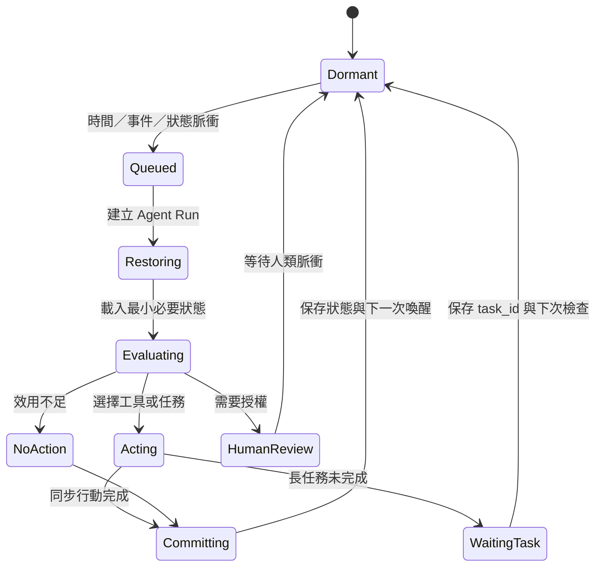
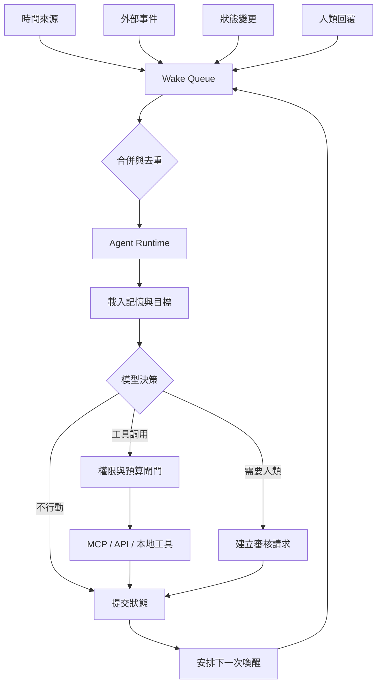

# 通用脈衝式 Agent：間歇喚醒、狀態連續性與自主工具調用的未來架構

**英文題名：** General Pulse-Driven Agents: Intermittent Wake-Up, State Continuity, and Autonomous Tool Invocation  
**版本：** v0.1  
**日期：** 2026-07-19  
**作者：** Neo.K／一言諾科技有限公司（EVEMISSLAB）  
**文件類型：** 觀察論文／架構命題／未來研究綱領  
**授權建議：** Apache-2.0 或 CC BY 4.0（由作者最終決定）

---

## 摘要

現有大型語言模型與多數 Agent 系統，通常在一次請求、一次工作階段或一段有限執行時間內展現推理與工具調用能力。它們可以在執行期間自主選擇工具，卻通常不能在模型未執行時「自行醒來」。因此，所謂持續性 Agent 往往被誤解為必須讓模型永久運轉、持續佔用算力或維持不間斷思考。

本文提出「通用脈衝式 Agent」（General Pulse-Driven Agent, GPDA）架構：Agent 平時處於休眠狀態，由時間、事件、狀態變化、任務完成或外部訊號產生離散喚醒脈衝；每次喚醒後，Agent 恢復必要狀態、重新評估目標與環境，自主判斷是否調用工具、建立任務、修改計畫、安排下一次喚醒，或選擇不採取行動。此架構將「持續存在」從持續計算改寫為跨脈衝的狀態、目標、權限與因果連續性。

本文區分喚醒、決策、工具執行與長任務四個層次，並指出 MCP 等工具協議只負責能力暴露與調用，不應被誤認為自主喚醒或完整 Agent Runtime。本文進一步提出狀態模型、效用閾值、事件佇列、冪等性、重試、權限、預算、審計與安全停止機制，作為未來脈衝式 Agent 的通用研究框架。

**關鍵詞：** 脈衝式 Agent、間歇喚醒、持續性 AI、Agent Runtime、MCP、自主工具調用、事件驅動、狀態連續性、長期記憶、權限治理

---

## 1. 問題提出

現有 Agent 系統常有三種模式：

1. **單次請求模式**：使用者送出請求，模型推理並調用工具，完成後結束。
2. **有限迴圈模式**：模型在一次工作中反覆規劃、執行、觀察，直到達成目標或耗盡步數。
3. **常駐服務模式**：外層程式持續運作，定時或因事件重新啟動模型。

第三種模式才接近長期 Agent，但常被錯誤描述成「AI 一直在思考」。實際上，模型在兩次執行之間通常沒有持續推理；真正持續存在的是資料庫、佇列、排程器、狀態機、權限設定與外部服務。

因此，本文提出下列核心命題：

> 持續性 Agent 不必依賴持續推理；它可以由離散喚醒與跨次狀態連續性構成。

這意味著 Agent 的連續性不必表示：

$$
\forall t,\quad \text{ModelRunning}(t)=1
$$

而可表示為：

$$
\forall k,\quad
S_{k+1}
=
F\left(
S_k,
E_k,
R_k
\right)
$$

其中：

- $S_k$：第 $k$ 次脈衝結束後保存的 Agent 狀態；
- $E_k$：下一次喚醒時收到的新事件；
- $R_k$：上次行動或外部世界產生的結果；
- $F$：狀態更新函數。

模型不必在任意時間點都執行，只需要在脈衝序列上維持可恢復、可驗證的連續性。

---

## 2. 定義：什麼是脈衝式 Agent

### 2.1 基本定義

脈衝式 Agent 是由以下六個元件構成的系統：

$$
\mathcal{A}
=
\left(
M,
G,
P,
W,
D,
X
\right)
$$

其中：

- $M$：記憶與持久狀態；
- $G$：目標、承諾與未完成工作；
- $P$：權限、安全與資源政策；
- $W$：喚醒機制；
- $D$：決策模型或決策程序；
- $X$：可調用工具、服務與執行環境。

系統平時不必運行模型。當喚醒條件成立時：

$$
W_t=1
$$

系統建立一次 Agent Run：

$$
R_t
=
D\left(
M_t,
G_t,
P_t,
E_t,
X_t
\right)
$$

Agent 的輸出不一定是外部行動，也可以是：

$$
A_t
\in
\left\{
\varnothing,
\text{CallTool},
\text{CreateTask},
\text{ModifyGoal},
\text{WriteMemory},
\text{ScheduleWake},
\text{RequestHuman}
\right\}
$$

其中 $\varnothing$ 表示經判斷後不採取行動。

### 2.2 「醒來」與「行動」必須分離

最重要的設計原則是：

$$
\text{Wake} \neq \text{Act}
$$

喚醒只代表系統重新給 Agent 一次觀察與判斷機會，不代表一定要執行工具。否則，定時喚醒會退化成傳統固定排程。

可定義行動效用：

$$
U_t(a)
=
B_t(a)
-
C_t(a)
-
R_t(a)
$$

其中：

- $B_t(a)$：預期效益；
- $C_t(a)$：算力、金錢、延遲與機會成本；
- $R_t(a)$：安全、權限、錯誤與不可逆風險。

若最佳行動仍未超過閾值：

$$
\max_a U_t(a) \leq \theta_t
$$

則 Agent 應選擇：

$$
A_t=\varnothing
$$

因此，「什麼都不做」必須被視為合法、可審計且常見的決策結果。

---

## 3. 為何不是讓模型持續運行

持續運行模型有五項基本問題：

### 3.1 成本不成比例

若環境在大多數時間沒有重要變化，持續推理會產生大量無資訊增益的計算。

定義每單位時間的資訊變化率為 $\lambda_E$，模型推理成本率為 $\lambda_C$。當：

$$
\lambda_E \ll \lambda_C
$$

持續推理是低效率策略。

### 3.2 無意義自循環

沒有新事件、沒有新資料、沒有新工具結果時，模型可能只是在既有上下文中重述、過度規劃或產生虛假進展。

### 3.3 上下文膨脹

長時間維持單一工作階段會造成上下文持續增長。即使模型支援長上下文，也不表示所有歷史都應在每次推理中重新載入。

### 3.4 故障難以隔離

永久迴圈容易把一次錯誤擴大成重複執行、重複付費、重複通知或重複寫入。

### 3.5 權限難以治理

若 Agent 永遠處於可行動狀態，權限管理會變成持續暴露。脈衝式執行則可在每次 Run 建立新的最小權限租約。

---

## 4. 脈衝來源分類

通用架構至少應支援五類脈衝。

### 4.1 時間脈衝

例如每小時、每日或某個絕對瞬間：

$$
I_t \geq I_{\text{target}}
$$

時間脈衝適合：

- 定期檢查；
- 期限前回顧；
- 日報與週報；
- 長期計畫維護；
- 延遲重試。

### 4.2 事件脈衝

由外部世界變化觸發，例如：

- 新郵件；
- GitHub Issue 或 Pull Request；
- 檔案修改；
- 監測指標越界；
- 新工作進入佇列；
- 外部 API 回傳結果。

### 4.3 狀態脈衝

由內部狀態改變觸發，例如：

- 任務從 `working` 變成 `completed`；
- 記憶衝突分數超過閾值；
- 預算剩餘低於閾值；
- 目標長時間沒有進展；
- 某依賴條件變為可用。

### 4.4 主觀時間脈衝

Agent 可以使用不同於牆鐘時間的時鐘，例如：

- 活動時間；
- 模擬世界時間；
- 任務內部時間；
- 暫停後不累積的生命史時間；
- 多倍速或分段速率的虛擬時間。

設父時間為 $I$，Agent 主觀時間為：

$$
\tau_A=\Phi_A(I)
$$

則可建立：

$$
\tau_A \geq \tau_{\text{target}}
\Rightarrow
\text{Wake}
$$

### 4.5 人類授權脈衝

當 Agent 遇到高風險、不可逆或資訊不足的決策時，應進入等待授權狀態。人類回覆本身就是下一個脈衝。

---

## 5. 通用生命週期



建議每一次 Agent Run 都有唯一識別碼：

$$
r_k=\operatorname{UUID}()
$$

並明確記錄：

- 喚醒原因；
- 載入了哪些記憶；
- 可使用哪些工具；
- 模型做了什麼決策；
- 是否執行外部副作用；
- 產生哪些新任務；
- 下一次喚醒如何安排；
- 是否需要人類介入。

---

## 6. 狀態連續性而非推理連續性

脈衝式 Agent 的持續性建立在四種連續性上。

### 6.1 記憶連續性

保存的不應只是對話全文，而應包括：

- 事件摘要；
- 目標狀態；
- 已知事實；
- 假設與信心水準；
- 未解問題；
- 工具結果索引；
- 版本與來源；
- 上次決策理由。

### 6.2 目標連續性

目標應具備狀態機，而不是只有一句自然語言：

```yaml
goal_id: goal:paper-translation
status: active
priority: 0.72
success_criteria:
  - all_files_translated
  - terminology_validation_passed
blocked_by:
  - glossary_review
next_review_at: 2026-07-20T10:00:00+08:00
```

### 6.3 權限連續性

權限不應永久繼承，而應在每次 Run 重新計算：

$$
P_k
=
P_{\text{base}}
\cap
P_{\text{goal}}
\cap
P_{\text{event}}
\cap
P_{\text{budget}}
$$

### 6.4 因果連續性

每次新行動必須能追溯到：

$$
\text{Event}
\rightarrow
\text{Decision}
\rightarrow
\text{Action}
\rightarrow
\text{Result}
\rightarrow
\text{StateUpdate}
$$

若無法追溯，Agent 可能只是表面上延續，實際上已失去任務因果鏈。

---

## 7. MCP 在架構中的位置

MCP 提供 Host、Client、Server 的能力協調架構。工具由 Server 暴露，由模型在 Host 的控制下選擇調用。MCP 解決的是標準化能力接入，而不是讓休眠中的模型自行醒來。

因此：

$$
\text{MCP}
\neq
\text{Wake Scheduler}
$$

$$
\text{MCP}
\neq
\text{Persistent Agent Memory}
$$

$$
\text{MCP}
\neq
\text{Complete Agent Runtime}
$$

更合理的層次是：

```text
Pulse Source
    ↓
Wake Scheduler / Event Queue
    ↓
Agent Runtime / MCP Host
    ↓
Model Decision
    ↓
MCP Client
    ↓
MCP Servers / Tools
```

MCP Tasks 可承載長時間工具執行，但它處理的是「已開始的請求如何延後完成」，不是「模型何時從休眠狀態重新執行」。

---

## 8. 最小通用架構



最低可用版本至少包含：

1. 持久化事件佇列；
2. Agent Run 資料表；
3. 目標與記憶儲存；
4. 模型調用器；
5. MCP Host；
6. 權限與預算閘門；
7. 冪等鍵；
8. 重試與死信佇列；
9. 審計記錄；
10. 下一次喚醒排程。

---

## 9. WakeEvent 資料模型

建議使用下列基本模型：

```json
{
  "event_id": "wake:01J...",
  "agent_id": "agent:primary",
  "source": {
    "kind": "temporal_trigger",
    "source_id": "trigger:hourly-review"
  },
  "created_at": "2026-07-19T12:00:00+08:00",
  "not_before": "2026-07-19T12:00:00+08:00",
  "expires_at": "2026-07-19T13:00:00+08:00",
  "reason": "periodic_review",
  "payload": {
    "goal_refs": ["goal:translation"],
    "memory_refs": ["memory:translation-status"]
  },
  "policy": {
    "allowed_capabilities": ["ctcl.read", "github.read"],
    "max_model_cost": 0.20,
    "max_tool_calls": 8,
    "human_confirmation_above_risk": "medium"
  },
  "delivery": {
    "status": "queued",
    "attempt_count": 0
  },
  "idempotency_key": "agent:primary:hourly-review:2026-07-19T12"
}
```

### 9.1 事件合併

若多個低優先事件在短時間內到達，可合併成一次 Run：

$$
\left\{
E_1,E_2,\ldots,E_n
\right\}
\rightarrow
E_{\text{batch}}
$$

以降低模型調用成本。

### 9.2 事件去重

對同一因果事件使用：

$$
K_{\text{idempotent}}
=
H\left(
\text{source},
\text{entity},
\text{version},
\text{time bucket}
\right)
$$

避免 webhook 重送或輪詢重複造成重複行動。

---

## 10. 自主決策政策

脈衝式 Agent 不應只由單一提示詞控制。建議使用三層決策。

### 10.1 確定性前置過濾

先由規則處理：

- 事件是否過期；
- 是否重複；
- Agent 是否停用；
- 預算是否耗盡；
- 所需權限是否可用；
- 是否在禁止時段；
- 是否已有相同任務執行中。

### 10.2 低成本分類

小模型或本地分類器判斷：

- 是否值得喚醒主模型；
- 事件重要性；
- 需要載入哪些記憶；
- 需要哪些工具集合。

### 10.3 主模型決策

主模型只在必要時處理：

- 多目標衝突；
- 不確定資訊；
- 工具選擇；
- 計畫修改；
- 下一次喚醒安排；
- 是否請求人類。

---

## 11. 安全與治理

### 11.1 最小權限

每次 Run 僅取得完成當次決策所需權限。

### 11.2 副作用分級

工具可分為：

- `read_only`；
- `reversible_write`；
- `external_communication`；
- `financial_or_legal`；
- `irreversible_high_risk`。

不同層級應有不同確認策略。

### 11.3 預算上限

每次 Run 應限制：

$$
C_{\text{run}}
\leq C_{\max}
$$

並限制：

- 模型 Token；
- MCP 調用次數；
- 外部 API 金額；
- 總執行時間；
- 併發任務數。

### 11.4 熔斷

當錯誤率或重試次數超標：

$$
N_{\text{fail}} \geq N_{\max}
\Rightarrow
\text{SuspendAgent}
$$

### 11.5 人類可停止性

任何常駐 Agent 都必須具有：

- 全域停用；
- 單一目標停用；
- 單一工具停用；
- 撤銷權限；
- 清除排程；
- 查看審計；
- 強制要求人工確認。

---

## 12. 失敗模式

### 12.1 喚醒風暴

大量事件同時到達，造成模型呼叫爆量。需使用合併、節流、優先級與退避。

### 12.2 重複副作用

事件重送導致重複寄信、重複提交、重複付款。需使用冪等鍵與外部操作回執。

### 12.3 虛假進展

Agent 每次醒來都更新計畫，卻沒有可驗證輸出。應要求每個目標具有外部可觀察的進度指標。

### 12.4 記憶漂移

摘要反覆壓縮後偏離原始資料。需保存來源指標、內容雜湊與可回溯原文。

### 12.5 權限累積

Agent 為了方便逐步擴張權限。應採租約式權限並在 Run 結束後失效。

### 12.6 不終止的自我排程

Agent 永遠安排下一次喚醒。應設定：

- 最大生命期；
- 目標結束條件；
- 無進展次數上限；
- 最低喚醒間隔；
- 人工續期。

---

## 13. 評估指標

### 13.1 有效喚醒率

$$
R_{\text{effective}}
=
\frac{\text{產生有效進展的 Run 數}}
{\text{全部 Run 數}}
$$

### 13.2 無行動合理率

無行動並非失敗。應抽樣評估 `no_action` 是否合理，而不是單純追求低比例。

### 13.3 每單位進展成本

$$
C_{\text{progress}}
=
\frac{\text{模型與工具總成本}}
{\text{可驗證進展單位}}
$$

### 13.4 重複副作用率

$$
R_{\text{duplicate}}
=
\frac{\text{非預期重複副作用}}
{\text{全部副作用}}
$$

理想值應趨近於零。

### 13.5 恢復正確率

Agent 在重新啟動後，能否正確恢復：

- 目標；
- 未完成任務；
- 工具結果；
- 下一步；
- 權限；
- 預算。

---

## 14. 分階段實現路線

### Phase 0：定時喚醒與固定提示

- Cron 喚醒；
- 載入單一狀態檔；
- 模型回傳 `act` 或 `no_action`；
- 僅允許讀取型工具。

### Phase 1：WakeEvent 與審計

- 事件佇列；
- 唯一 Run ID；
- 冪等鍵；
- 決策與工具調用日誌；
- 下一次喚醒。

### Phase 2：MCP Host 與能力政策

- 動態工具發現；
- 每次 Run 的能力白名單；
- 工具風險分級；
- 人類確認閘門。

### Phase 3：長任務與非同步恢復

- task_id；
- 任務狀態輪詢；
- 任務完成事件；
- 延後取回結果；
- 失敗重試與取消。

### Phase 4：多目標與多 Agent

- 目標優先級；
- Agent 間委派；
- 共同事件匯流排；
- 共享資源鎖；
- 衝突解決。

### Phase 5：主觀時間與適應性脈衝

- Agent 活動時間；
- 虛擬世界時鐘；
- 根據事件率動態改變喚醒頻率；
- 根據不確定性自動縮短或延長間隔。

---

## 15. 研究命題

### 命題一：持續性可由離散狀態閉包近似

若每次 Agent Run 都能完整保存足以重建下一次決策的最小狀態，則在功能層面可形成近似持續性：

$$
\mathcal{C}
\approx
\operatorname{Closure}
\left(
S_0,
E_1,
F_1,
E_2,
F_2,
\ldots
\right)
$$

### 命題二：適應性脈衝優於固定高頻輪詢

當事件率非均勻時，根據環境變化自動調節喚醒間隔，可在相同可靠度下降低成本。

### 命題三：Agent 的主體連續性主要是承諾連續性

對工程系統而言，Agent 是否「同一個」不只由模型版本決定，而更多由下列項目共同決定：

$$
\text{Identity Continuity}
=
f\left(
\text{Memory},
\text{Goals},
\text{Commitments},
\text{Policies},
\text{Causal History}
\right)
$$

### 命題四：不行動能力是自主性的必要條件

若系統每次喚醒都被迫行動，它只是條件式自動化；只有能根據狀態選擇不行動，才接近真正的自主決策。

---

## 16. 與傳統排程器的差異

| 類型 | 觸發後行為 | 是否重新判斷 | 是否可選擇不行動 | 是否可重排下一次喚醒 |
|---|---|---:|---:|---:|
| Cron | 固定命令 | 否 | 否 | 通常否 |
| Workflow | 固定 DAG | 局部 | 少量 | 有限 |
| Rule Engine | 固定規則 | 規則式 | 是 | 有限 |
| 脈衝式 Agent | 模型與政策共同決策 | 是 | 是 | 是 |

脈衝式 Agent 並不是取代所有排程器，而是把排程器變成喚醒來源之一。

---

## 17. 未來方向

未來研究可包含：

1. **事件重要性學習**：Agent 從過往結果學習哪些事件值得喚醒。
2. **喚醒頻率自適應**：根據環境變動、風險與預算動態改變頻率。
3. **記憶最小充分集**：研究每次 Run 最少需要載入哪些狀態。
4. **多 Agent 共同時間**：多個 Agent 在同一參考瞬間上協調行動。
5. **主觀生命史**：區分牆鐘時間、活動時間、休眠時間與模擬時間。
6. **可驗證決策鏈**：對關鍵行動產生形式化政策證明或可重播日誌。
7. **長期承諾治理**：防止 Agent 在模型更新後遺失或任意改寫既有承諾。
8. **跨裝置遷移**：Agent 從一個 Runtime 遷移到另一個 Runtime，仍保持脈衝與狀態連續。

---

## 18. 結論

通用脈衝式 Agent 將「持續智能」從不間斷模型執行，重新定義為由離散喚醒、狀態恢復、自主決策、工具調用與再次休眠所構成的循環。

其核心不是讓 AI 永遠思考，而是確保：

$$
\text{醒來時知道自己為何醒來}
$$

$$
\text{知道目前仍承擔哪些目標與限制}
$$

$$
\text{能判斷是否值得行動}
$$

$$
\text{能安全地使用工具}
$$

$$
\text{能把結果與下一次喚醒保存下來}
$$

因此，未來的持續性 Agent 很可能不是一條永久運轉的思考流，而是一系列具有因果連續性、權限約束與記憶閉包的智能脈衝。

---

## 參考資料

1. Model Context Protocol, “Architecture,” protocol specification.
2. Model Context Protocol, “Tools,” protocol specification.
3. Model Context Protocol, “Transports,” protocol specification.
4. Model Context Protocol, “Tasks,” protocol specification, experimental.
5. CTCL — Common Temporal Coordinate Layer, project documentation and public implementation.
6. CTCL Temporal Port, Trigger Engine and Local Gateway implementation notes.

